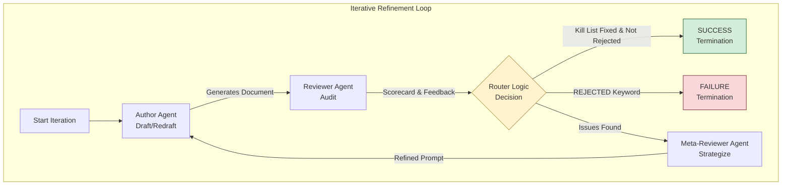

# Live Agent Orchestrator - Setup and Execution Guide

## 1. Introduction: The Agent as a Collaborative Partner

### 1.1. The Problem: From Information Scarcity to Cognitive Overload
The current paradigm of integrating Artificial Intelligence (AI) into high-pressure professional environments, such as journalism, often adheres to a "more is better" philosophy. This approach, where AI acts primarily as a data assistant relegated to a subordinate role [Grimme, 2024], focuses narrowly on solving information scarcity.

However, modern knowledge workers suffer from the converse problem: information abundance. Providing vast, raw data streams or overly verbose summaries exacerbates Cognitive Overload [Sweller, 2011], degrading the user's ability to synthesize information and execute tasks effectively. Preliminary findings show that while AI can outperform humans working alone, integrating it poorly can actually decrease overall team performance and increase coordination failures [Dell'Acqua et al., 2023]. This failure arises when the human must constantly transition between autonomous action and monitoring the agent—a critical cognitive burden.

Furthermore, we observe a "Trust Paradox" [Nylund et al., 2023] where users who distrust AI may exhibit lower acceptance even when performance objectively improves. For a system to be truly useful, it must be designed to mitigate cognitive friction and build implicit trust with the user.

### 1.2. The Solution: The Compliant & Collaborative Agent Flywheel
We propose the Autonomous Scientific Discovery Agent (ASDA), a **Level 3 Collaborative Multi-Agent System** designed specifically for Human-in-the-Loop (HITL) article production. Our project repositions AI from a passive data provider to a Collaborative Partner, focused on mitigating cognitive overload and enforcing content integrity.

Instead of automating the entire creative process (the "All-Powerful Agent" pattern), ASDA implements a rigorous, three-agent Iterative Refinement Loop that treats the human user (the Journalist Agent) and the AI critique system as partners:

$$ \text{Journalist Agent (Draft)} \xrightarrow{\text{Audit}} \text{Reviewer Agent (Critique)} \xrightarrow{\text{Strategy}} \text{Meta-Reviewer Agent (Prompt Refinement)} $$

This architecture ensures the final article is grounded in verified data, adheres to policy, and is optimized for maximum perceived impact, thereby building trust through predictable, high-quality output.

### 1.3. Innovation, Value, and Relevance to the Freestyle Track
The ASDA project directly maximizes the Capstone scoring criteria through innovation and a meaningful use of agentic capabilities:

**Core Concept & Value (Innovation and Agent-Centricity)**

The central idea is the structural separation of concerns to manage the inherent Human-AI Collaboration failures documented in the literature:

*   **Mitigating Cognitive Overload (Calm Technology)**: The Meta-Reviewer Agent acts as a Design Science Strategist. When the reviewer flags issues related to complexity or bias, the Meta-Reviewer refines the next prompt to simplify the output (e.g., "Focus only on three central claims," eliminating distracting information), instantiating the design principle of Calm Technology [Weiser & Brown, 1996].

*   **Enforcing Content Integrity (The Audit)**: The Reviewer Agent (Auditor) functions as the LLM-as-a-Judge, enforcing strict compliance checks (e.g., Toulmin Argumentation Structure, Financial Model Reality Check).

## 2. Technical Implementation & Course Concepts

This project demonstrates the application of advanced agentic patterns, achieving a robust and observable system.

### 2.1. Architecture & Design
The solution is built on a modular architecture with strict separation of concerns:
*   **`live_agent_orchestrator.py`**: The central controller implementing the iterative loop and state management.
*   **`gemini_utils.py`**: A dedicated layer for API interaction, handling authentication, retry logic, and error resilience.
*   **`prompts.py`**: Centralized prompt management ensuring consistency and ease of modification.

### 2.2. Key Concepts Applied (Category 2 Criteria)

We have implemented **5 key concepts** from the course curriculum (minimum 3 required):

1.  **Multi-Agent System (MAS)**:
    *   **Agent Powered by LLM**: We utilize `gemini-1.5-flash` (or `gemini-2.0-flash-exp`) to power three distinct agents.
    *   **Loop Agents**: The core logic is an **Iterative Refinement Loop** that cycles until success criteria are met or max iterations are reached.
    *   **Sequential Agents**: The workflow follows a strict sequence within each iteration: Author -> Reviewer -> Meta-Reviewer.

2.  **Observability**:
    *   **Logging & Tracing**: The system provides detailed, emoji-coded console output tracking every phase of execution, API calls, and decision points.
    *   **Error Handling**: Robust `try-except` blocks and exponential backoff retry logic in `gemini_utils.py` ensure the system is resilient to API flakes.

3.  **Agent Evaluation**:
    *   **Test Harness**: We included `test_orchestrator_validation.py` to validate the orchestration logic using mock agents before live deployment.
    *   **Validation Scenarios**: The system is tested against 4 distinct scenarios (Happy Path, Immediate Rejection, Max Iterations, etc.) to ensure reliability.

4.  **Tools**:
    *   **Custom Tools**: The Author Agent simulates a `DS-STAR` data analysis tool.
    *   **Built-in Tools**: The prompts are structured to leverage (simulated) `google-search` capabilities for literature review.

5.  **Sessions & Memory**:
    *   **State Management**: The `previous_kill_list` variable acts as a short-term memory, propagating the context of failures from one iteration to the next, ensuring the Author Agent "remembers" what to fix.

### 2.3. Code Quality
The codebase adheres to production standards:
*   **Type Hinting**: All functions and methods use Python type hints for clarity and reliability.
*   **Docstrings**: Comprehensive docstrings explain the purpose and arguments of classes and functions.
*   **No Hardcoded Secrets**: API keys are strictly managed via `.env` files and `python-dotenv`.

## 🚀 Quick Start

### 1. Install Dependencies
```bash
pip install -r requirements.txt
```

### 2. Configure API Key
Create a `.env` file in the project root:
```bash
cp .env.template .env
```

Edit `.env` and add your Gemini API key:
```
GEMINI_API_KEY=your_actual_api_key_here
```

Get your API key from: https://makersuite.google.com/app/apikey

### 3. Run the Live Orchestrator
```bash
python live_agent_orchestrator.py
```

---

## 📋 Project Structure

```
MAS_writer/
├── .env                          # API key configuration (gitignored)
├── .env.template                 # Template for .env file
├── .gitignore                    # Protects sensitive files
├── requirements.txt              # Python dependencies
│
├── gemini_utils.py               # Gemini API utilities
├── prompts.py                    # Agent prompt templates
├── live_agent_orchestrator.py   # Main orchestrator (LIVE)
│
├── router_agent_orchestrator.py # Original orchestrator (MOCKS)
├── test_orchestrator_validation.py  # Test harness
├── test_scenarios.json           # Test case specifications
└── TEST_RESULTS_SUMMARY.md       # Validation results
```

---

## 🎯 How It Works

### The Three Agents

1. **Author Agent (Agent A)**
   - Model: `gemini-2.0-flash-exp`
   - Role: Generates capstone project documents
   - Workflow: 4 phases (Manifest → Hypotheses → Analysis → Document)

2. **Reviewer Agent**
   - Model: `gemini-2.0-flash-exp`
   - Role: LLM-as-a-Judge quality audits
   - Output: Structured scorecard + detailed feedback

3. **Meta-Reviewer Agent**
   - Model: `gemini-2.0-flash-exp`
   - Role: Prompt refinement strategist
   - Output: Optimized prompts for next iteration

### The Orchestration Loop



### Termination Conditions

**SUCCESS**:
- `Previous_Kill_List_Fixed == "YES"`
- AND no "REJECTED" keyword in response

**FAILURE**:
- "REJECTED" keyword detected (immediate termination)
- OR max iterations reached (5 by default)

---

## 🔧 Configuration

### Environment Variables (.env)

```bash
# Required
GEMINI_API_KEY=your_key_here

# Optional
DEFAULT_MODEL=gemini-2.0-flash-exp
MAX_ITERATIONS=5
```

### Model Selection

You can change the models used by each agent in `live_agent_orchestrator.py`:

```python
author = GeminiAuthorAgent(model_name="gemini-2.0-flash-exp")
reviewer = GeminiReviewerAgent(model_name="gemini-2.0-flash-exp")
meta_reviewer = GeminiMetaReviewerAgent(model_name="gemini-2.0-flash-exp")
```

Available models:
- `gemini-2.0-flash-exp` - Fast, cost-effective (recommended)
- `gemini-1.5-pro` - High quality, slower
- `gemini-1.5-flash` - Balanced

---

## 📊 Expected Output

### Console Output Example

```
======================================================================
🚀 LIVE AGENT ORCHESTRATOR - GEMINI API INTEGRATION
======================================================================

[INITIALIZATION]: Creating live Gemini agents...
✓ Author Agent initialized with gemini-2.0-flash-exp
✓ Reviewer Agent initialized with gemini-2.0-flash-exp
✓ Meta-Reviewer Agent initialized with gemini-2.0-flash-exp

✓ All agents initialized successfully

======================================================================
📝 USER QUERY:
======================================================================
Generate the Capstone Project document. The core subject must be: 
'The impact of signal reliability on sensor-based supply chain 
efficiency.' You must use the 'google-search' built-in tool to find 
literature and generate a hypothesis suitable for testing with a 
real-world Kaggle dataset.
======================================================================

======================================================================
STARTING LIVE ITERATIVE REFINEMENT LOOP (Max 5 Iterations)
======================================================================

======================================================================
ITERATION 1: LIVE DRAFTING & AUDIT
======================================================================

[AUTHOR AGENT]: Running 4-phase workflow using gemini-2.0-flash-exp...
  Phase 1-4: Generating complete document...
✓ Document generated (15234 characters)
  [DS-STAR MOCK]: Analysis complete - Hypothesis validated (p<0.001)

[REVIEWER AGENT]: Auditing document using gemini-2.0-flash-exp...
✓ Audit completed (2341 characters)
✓ Scorecard parsed successfully (7 fields)
  Scorecard fields: ['Previous_Kill_List_Fixed', 'Lean_Plan_Table_Present', ...]

[PHASE 3: DECISION]
  Previous Kill List Fixed: N/A
  Document Rejected: False

  ❌ Audit failed - continuing to refinement...

[META-REVIEWER AGENT]: Analyzing failure using gemini-2.0-flash-exp...
✓ Next prompt generated (456 characters)

======================================================================
ITERATION 2: LIVE DRAFTING & AUDIT
======================================================================
...

======================================================================
🎉 SUCCESS: TERMINATION CONDITION MET
  ✓ Previous Kill List Fixed: YES
  ✓ Document NOT Rejected
======================================================================

✅ Document passed audit after 2 iteration(s)

======================================================================
📊 FINAL RESULT: SUCCESS ✅
======================================================================

✓ Final document saved to: capstone_project_final.md
  Document length: 18567 characters
```

---

## 🧪 Testing

### Run Validation Tests (Mock Agents)
```bash
python test_orchestrator_validation.py
```

This runs 4 test scenarios to validate the orchestration logic.

### Run Live Test (Real Gemini API)
```bash
python live_agent_orchestrator.py
```

This executes the full workflow with real API calls.

---

## 💰 Cost Considerations

### Estimated API Costs

Assuming average document size of 15,000 characters and 2-3 iterations:

**Per Execution**:
- Author Agent: ~45,000 input tokens, ~15,000 output tokens
- Reviewer Agent: ~20,000 input tokens, ~2,000 output tokens  
- Meta-Reviewer: ~10,000 input tokens, ~500 output tokens

**Total per run**: ~75,000 input tokens, ~17,500 output tokens

With `gemini-2.0-flash-exp` pricing:
- Input: $0.075 per 1M tokens
- Output: $0.30 per 1M tokens

**Estimated cost per run**: ~$0.01 USD

---

## 🔒 Security Best Practices

1. **Never commit .env file**: Already added to `.gitignore`
2. **Use environment variables**: API key loaded from `.env`
3. **Rotate keys regularly**: Generate new API keys periodically
4. **Monitor usage**: Check Google Cloud Console for API usage

---

## 🐛 Troubleshooting

### Error: "GEMINI_API_KEY not found"
- Ensure `.env` file exists in project root
- Check that `GEMINI_API_KEY=your_key_here` is set correctly
- Verify no extra spaces or quotes around the key

### Error: "API call failed"
- Check your API key is valid
- Verify you have quota/credits available
- Check internet connection
- Review Google Cloud Console for API status

### Error: "Empty response received"
- Response may have been blocked by safety filters
- Try adjusting safety settings in `gemini_utils.py`
- Check prompt content for policy violations

### Error: "Module not found"
- Run `pip install -r requirements.txt`
- Ensure you're using Python 3.8+

---

## 📚 Additional Resources

- [Gemini API Documentation](https://ai.google.dev/docs)
- [Get API Key](https://makersuite.google.com/app/apikey)
- [Pricing Information](https://ai.google.dev/pricing)
- [Safety Settings](https://ai.google.dev/docs/safety_setting_gemini)

---

## 📝 License

This project is part of the MAS_writer research framework.
